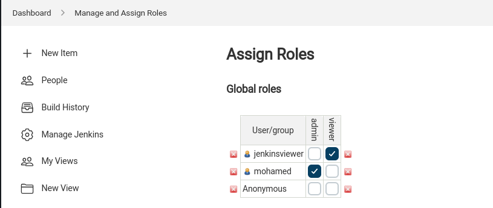
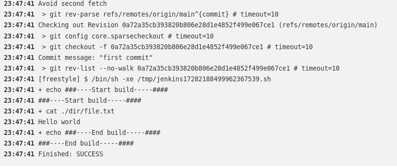
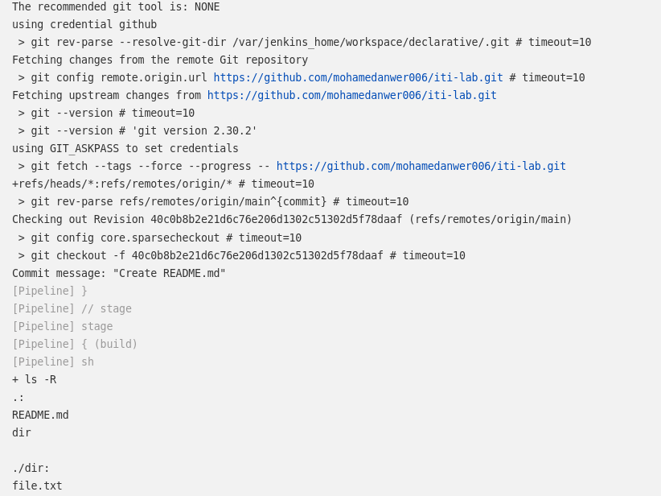
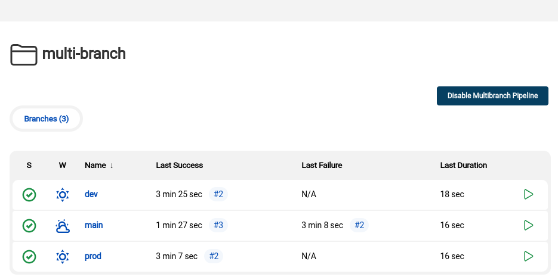

# Jenkins

1. install jenkins with docker image

``` bash
└─ mohamed@DevOps:$ docker pull jenkins/jenkins:lts
└─ mohamed@DevOps:$ docker run --name jenkins -d -p8080:8080 jenkins/jenkins:lts
0c8869f7380bb9687a0c628cc2b07bb2d92ac43877c25ac51d16e485267d5ec8

```
2. install role based authorization plugin

3. create new user

4. create read role and assign it to the new user




5. create free style pipeline and link it to private git repo(inside it create directory and create file with "hello world")
 


------


1. create declarative in jenkins GUI pipeline for your own repo to do "ls"

```bash
pipeline {
    agent any

    stages {
        stage('Preparation') {
            steps {
                checkout changelog: false, poll: false, scm: [$class: 'GitSCM', branches: [[name: '*/main']], extensions: [], userRemoteConfigs: [[credentialsId: 'github', url: 'https://github.com/mohamedanwer006/iti-lab.git']]]
               
            }
        }
        
        stage('Build') {
            steps {
                 sh 'ls -R'
            }
            
        }
    }
}
```


2. create scripted in jenkins GUI pipeline for your own repo to do "ls"

```bash

node {
    stage('Preparation') { // for display purposes
        // Get some code from a GitHub repository
        checkout changelog: false, poll: false, scm: [$class: 'GitSCM', branches: [[name: '*/main']], extensions: [], userRemoteConfigs: [[credentialsId: 'github', url: 'https://github.com/mohamedanwer006/iti-lab.git']]]
    }
    stage('Build') {
         sh 'ls -R'
    }
}

```



3. create the same with jenkinsfile in your branches as multibranch pipeline



4. try to create jenkins image with casc and install slack notification plugin and main suggested plugins inside it

5. casc will contain creation of user and creation of credential for your dockerhub

```yaml
jenkins:
  securityRealm:
    local:
      allowsSignup: false
      users:
        - id: "admin"
          password: "admin"
        - id: "dev"
          password: "dev"

credentials:
  system:
    domainCredentials:
      - credentials:
          - usernamePassword:
              scope: GLOBAL
              id: "dockerhub"
              username: "mohameddev006"
              password: "1234456789"
              description: "Username/Password Credentials for DockerHub"

```