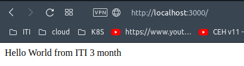
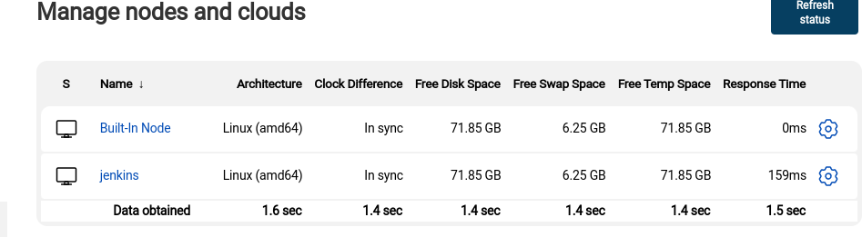
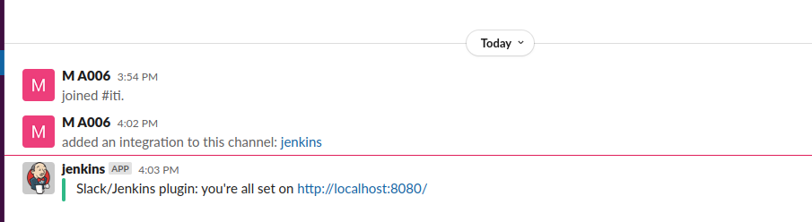
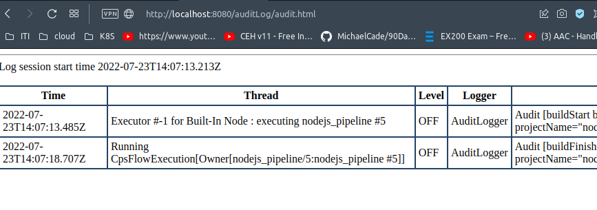

4. configure jenkins image to run docker commands on your host docker daemon

```Dockerfile
FROM jenkins/jenkins:lts
USER root

# install Docker client
RUN apt-get update -y && apt-get install -y apt-transport-https ca-certificates curl software-properties-common gnupg2
RUN curl -fsSL https://download.docker.com/linux/debian/gpg | apt-key add -
RUN add-apt-repository "deb [arch=amd64] https://download.docker.com/linux/debian $(lsb_release -cs) stable"
RUN apt-get update -y && apt-get install -y docker-ce

RUN usermod -aG docker jenkins

```
### start container
```bash
docker run --name jdocker -p8080:8080 -d -v /var/run/docker.sock:/var/run/docker.sock jdocker
```
5. create CI/CD for this repo https://github.com/mahmoud254/jenkins_nodejs_example.git

```Dockerfile
pipeline {
    agent any

    stages {
        stage('checkout') {
            steps {
                git 'https://github.com/mohamedanwer006/jenkins_nodejs_example.git'
            }
        }
        
        stage('build') {
            
            steps {
                
                sh 'docker build -t mohameddev006/iti-node-app:latest .'
                withCredentials([usernamePassword(credentialsId: 'docker', usernameVariable: 'USERNAME', passwordVariable: 'PASSWORD')]) {
                     sh "docker login -u ${USERNAME} -p ${PASSWORD}"
                     sh "docker push mohameddev006/iti-node-app:latest"
                     sh "docker run -p -d 3000:3000 mohameddev006/iti-node-app:latest"
                    }
            }
            
        }
    }
}

```


----

1- create docker file to build image for jenkins slave

```dockerfile
FROM ubuntu:latest

USER root
# install openssh-server openjdk8
RUN apt-get update -y && apt-get install -y openjdk-8-jdk openssh-server

RUN useradd -m -s /bin/bash jenkins
COPY jenkins.pub /home/jenkins/.ssh/authorized_keys
RUN chown -R jenkins:jenkins /home/jenkins/.ssh
RUN chmod 700 /home/jenkins/.ssh
RUN chmod 644 /home/jenkins/.ssh/authorized_keys

USER jenkins
RUN mkdir /home/jenkins/jenkins_home
WORKDIR /home/jenkins/jenkins_home

USER root
ENTRYPOINT service ssh restart && bash

```
2- create container from this image and configure ssh 

3 from jenkins master create new node with the slave container



4- integrate slack with jenkins

5- send slack message when stage in your pipeline is successful



6- install audit logs plugin and test it



create github actions pipeline to build docker image and push to dockerhub

```yaml
name: Docker

on:
  push:
    branches:
      - master

jobs:
  test:
    runs-on: ubuntu-latest
    steps:
      - uses: actions/checkout@v2
      - name: Stage artifacts
        run: |
            docker build . --file dockerfile -t mohameddev006/web-app:latest
            docker login -u ${{ secrets.DOCKER_HUB_USER}} -p ${{secrets.DOCKER_HUB_PASS}}
            docker push mohameddev006/web-app:latest

```